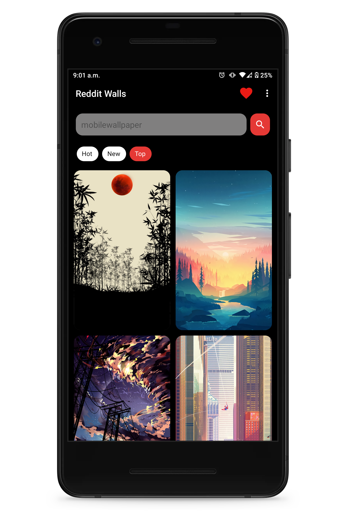
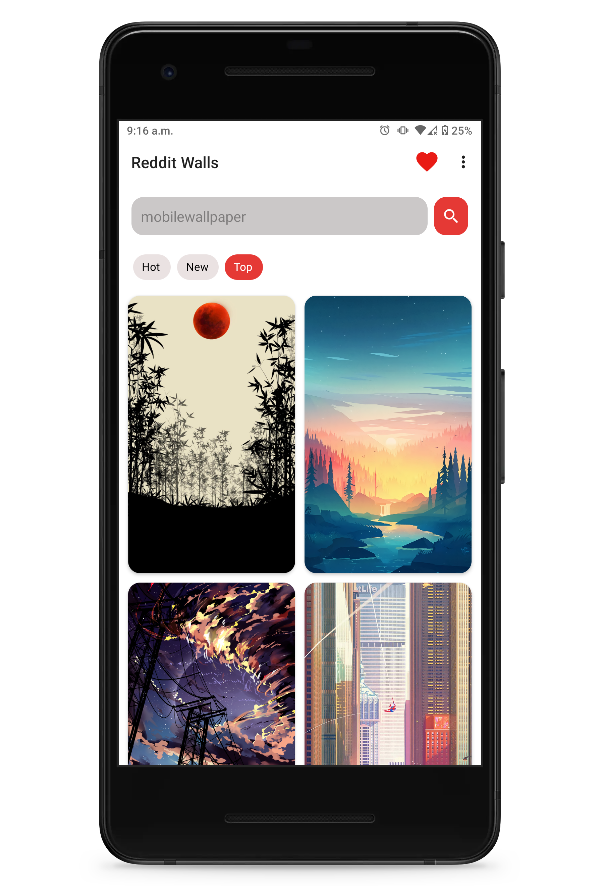

# RedditWall
An app that pulls images from a specified subreddit to set as device wallpaper
- This app takes a query and uses Reddit's REST api to pull data in a JSON format
- Parses the JSON data returned by the REST api and scrapes for image urls
- Loads the image urls to be set as wallpapers

## Features
- Loads images from a specified subreddit into a gridview user interface
- Loads more images on scroll
- View subreddit info
- Preview image and have the option to set it as a wallpaper
- Swipe left or right to view the next or previous preview
- Options between setting the home or lock screen wallpaper
- Specify the image resolution in settings
- Specify a default subreddit to load from on start up
- Sort Reddit images by new or by hot
- Search for subreddits
- Save favorite subreddits using a Room database. Click on saved sub to search for images
- Long press a saved sub to set it as the default one
- Ability to download the image
- Save favorite images to be viewed later
- Set scale down for images being loaded in gridview to minimize bandwidth consumption
- View a list of curated subreddit recommendations stored in a remote database to get wallpapers from
- View history of downloaded or set wallpapers
- Place a widget on the homescreen that allows you to quickly switch to another random wallpaper from you favorites list
### Dark Mode Screenshots

### Light Mode Screenshots

## Download
Download the apk [here](https://github.com/meh430/RedditWall/releases/download/v0.82-beta/reddit-walls-0.82b.apk)
