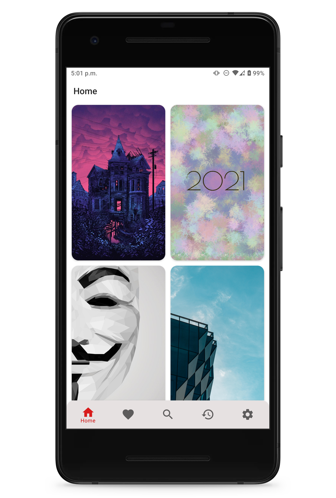
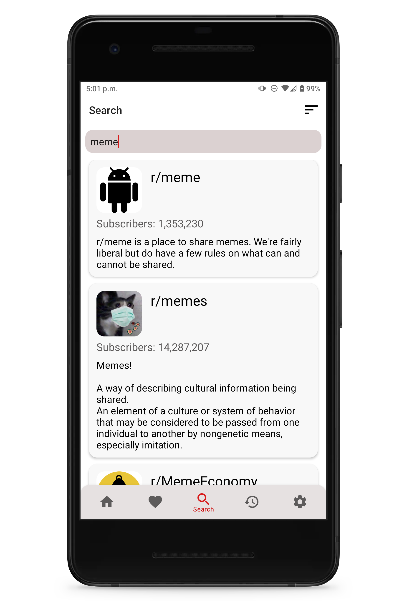
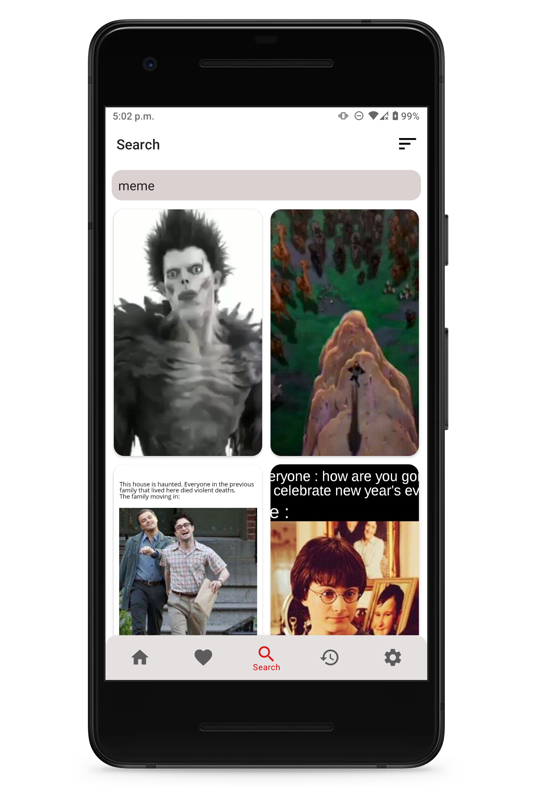

# RedditWall
An app that uses the model-view-viewmodel pattern with the help of Android Jetpack libraries and pulls images from a specified subreddit to set as device wallpaper

## Features
- Loads images from a specified subreddit into a gridview user interface
- Preview image and have the option to set it as a wallpaper
- Options between setting the home or lock screen wallpaper
- Specify the image resolution in settings
- Specify a default subreddit to load from on start up
- Sort Reddit images by new, hot, or top
- Search for subreddits
- Ability to download the image
- Save favorite images to be viewed later
- Place a widget on the homescreen that allows you to quickly switch to another random wallpaper from you favorites list
- Set scale down for images being loaded in gridview to minimize bandwidth consumption
- View history of downloaded or set wallpapers
### Light Mode Screenshots

### Dark Mode Screenshots

## Download
Download the apk [here](https://github.com/meh430/RedditWall/releases/download/v0.85-beta/reddit-walls-0.85b.apk)
