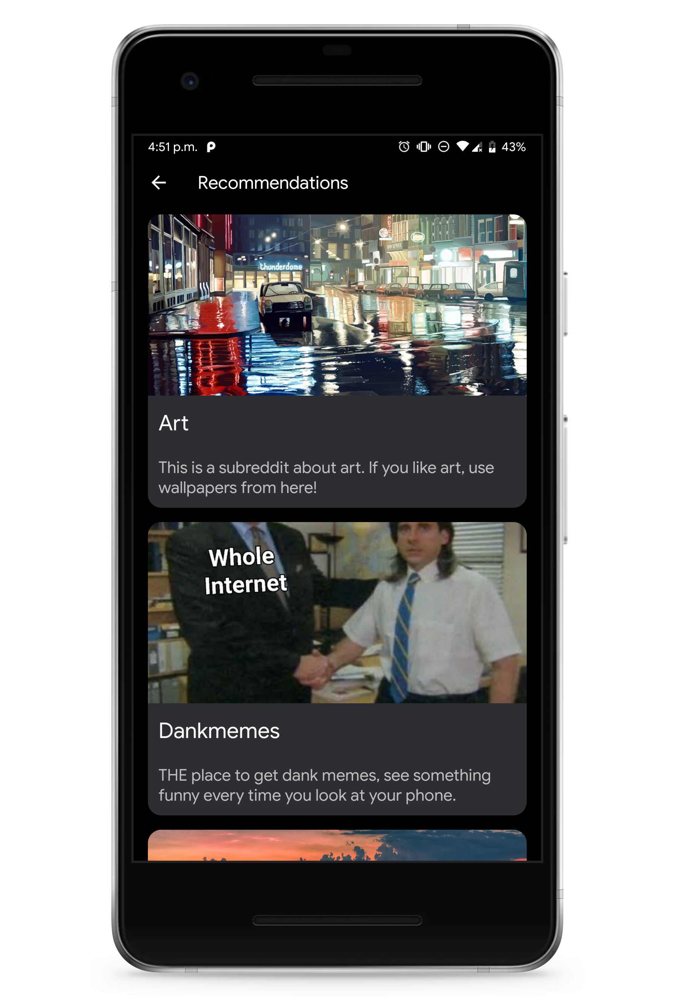
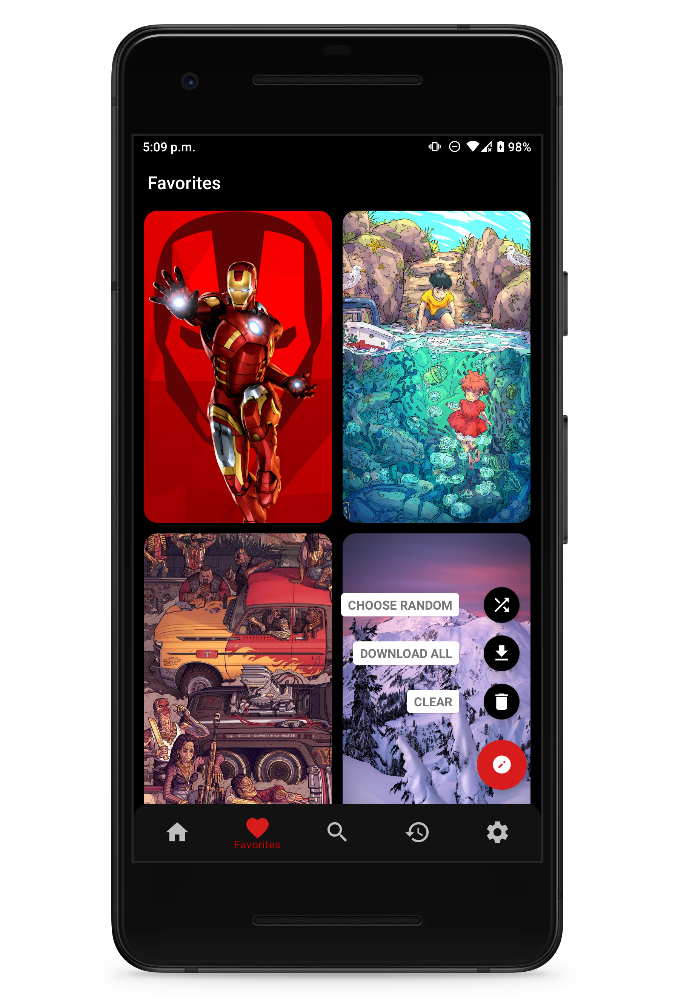

# RedditWall
An app that pulls images from a specified subreddit to set as device wallpaper
- This app takes a query and uses Reddit's REST api to pull data in a JSON format
- Parses the JSON data returned by the REST api and scrapes for image urls
- Loads the image urls to be set as wallpapers

## Features
- Loads images from a specified subreddit into a gridview user interface
- Loads more images on scroll
- Preview image and have the option to set it as a wallpaper
- Swipe left or right to view the next or previous preview
- Options between setting the home or lock screen wallpaper
- Specify the image resolution in settings
- Specify a default subreddit to load from on start up
- Sort Reddit images by new or by hot
- Save favorite subreddits using a Room database. Click on saved sub to search for images
- Long press a saved sub to set it as the default one
- Ability to download the image
- Save favorite images to be viewed later
- Set scale down for images being loaded in gridview to minimize bandwidth consumption
- View a list of curated subreddit recommendations stored in a remote database to get wallpapers from
### Dark Mode Screenshots

## Features in Progress/Planned Features
- Ability to specify a download path in settings
- Store wallpaper setting and download history to be viewed later
- Randomly chosen wallpaper from list of favorites that refreshes at a specified interval
- Setting for only allowing downloads when connected to wifi
- GIF support. Be able to set GIFs as wallpaper
